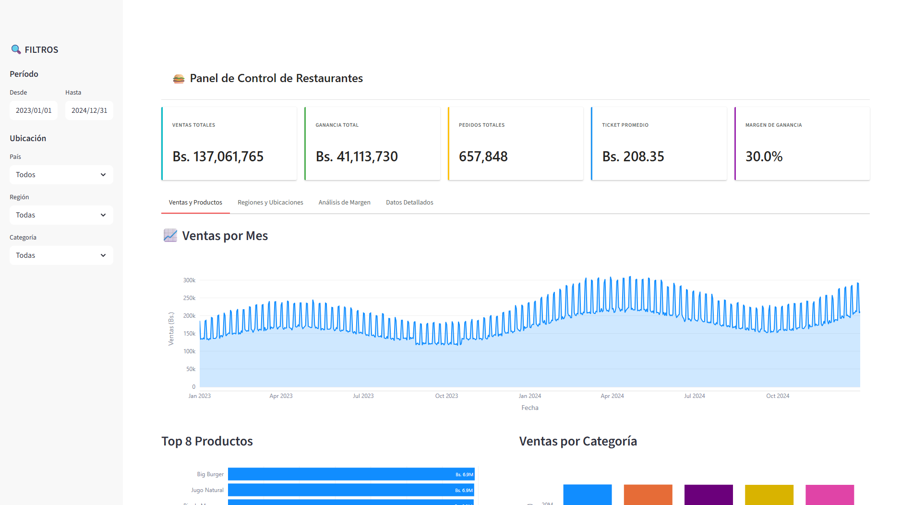
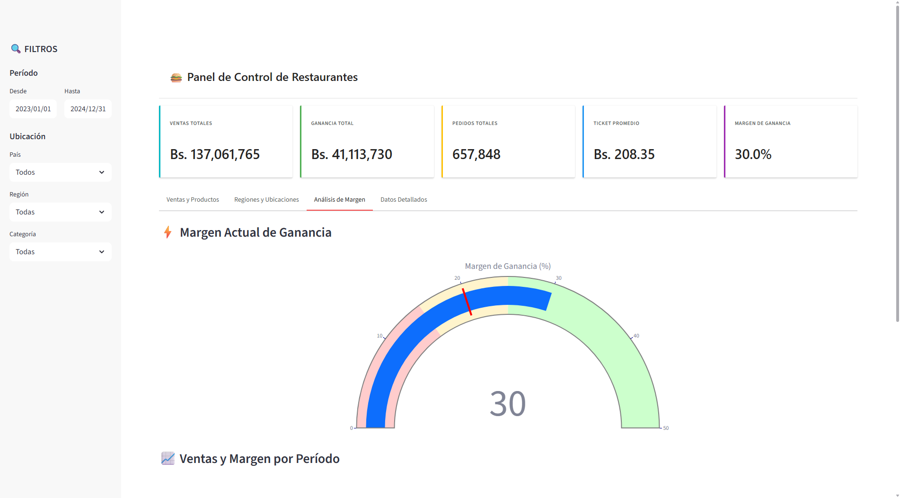
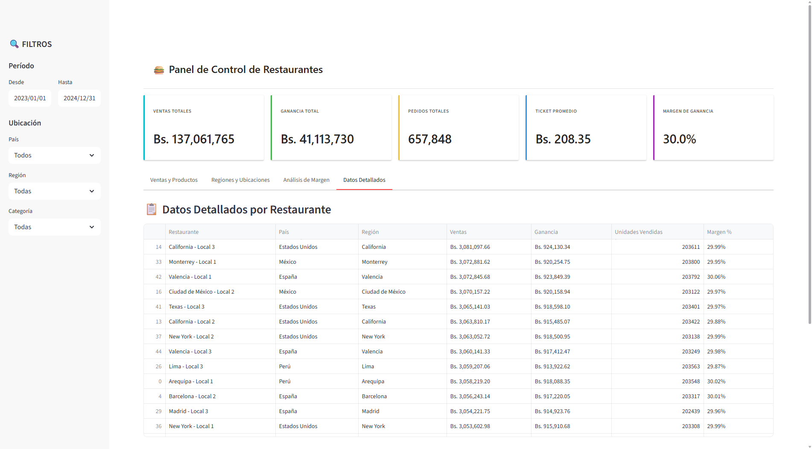

# 🍔 Dashboard de Restaurantes

Panel de control estratégico para cadena de restaurantes desarrollado con Python y Streamlit.

## 📊 Capturas del Dashboard

### 1. KPIs Principales
Vista general con los 5 indicadores clave de rendimiento:
- Ventas Totales
- Ganancia Total
- Pedidos Totales
- Ticket Promedio
- Margen de Ganancia

---

### 2. Ventas y Productos
Análisis de tendencias de ventas, top productos y ventas por categoría.

---

### 3. Regiones y Ubicaciones
Distribución geográfica de ventas, desempeño por sucursal y análisis regional.

---

### 4. Análisis de Margen
Indicador de margen de ganancia con rangos de referencia y evolución temporal.

---

### 5. Datos Detallados
Tabla completa con métricas detalladas por restaurante.

---

## 🛠️ Tecnologías Utilizadas

- **Python** - Lenguaje de programación
- **Streamlit** - Framework para dashboards interactivos
- **Plotly** - Librería de visualización de datos
- **Pandas** - Procesamiento de datos
- **NumPy** - Cálculos numéricos

## 🚀 Características

- ✅ Interfaz estilo Power BI
- ✅ Filtros interactivos (fechas, países, regiones, categorías)
- ✅ Visualizaciones dinámicas
- ✅ Análisis multidimensional
- ✅ Datos de muestra de 5 países
- ✅ Sistema de pestañas organizado
- ✅ Responsive design

## 📈 Datos Simulados

El dashboard incluye datos de ejemplo de:
- 🌎 5 países (Perú, Estados Unidos, México, Colombia, España)
- 🏪 45 restaurantes distribuidos en 15 regiones
- 🍔 5 categorías de productos
- 📅 2 años de datos históricos (2023-2024)

---

Desarrollado con Python + Streamlit | © 2025
